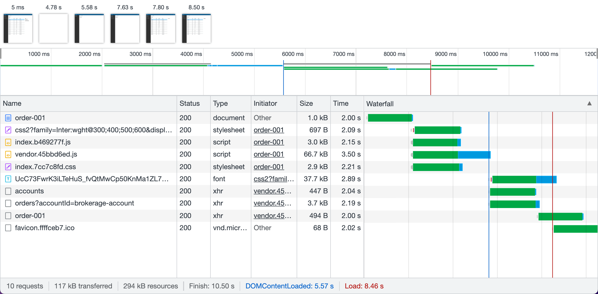
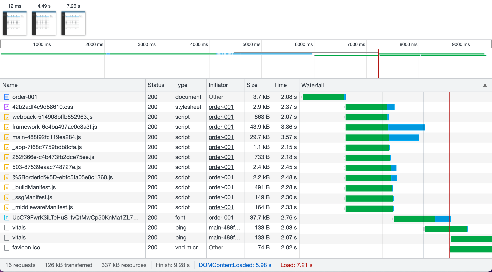

# Nested Routes

This project evaluates nested routes as implemented by the following frameworks:

1. [React Router](https://reactrouter.com/)
2. [Next.js](https://nextjs.org/)
3. [Remix](https://remix.run/)

For this, I wrote a small trading application that shows holdings and orders in
a user's (multiple) trading accounts. Here are the key screens along with their
routes.

## Home Page

**Route**: `/`

## Holdings Page

**Route**: `/accounts/brokerage-account/holdings`

## Orders Page

**Route**: `/accounts/brokerage-account/orders/order-001`

## Observations

Let's analyze the Orders page shown above, which is the most complex screen of
the three. It displays the user's trading accounts in the left sidebar, a table
of orders in the selected account in the middle and a card showing the details
of the selected order on the right.

The nested route for this page is
`/accounts/brokerage-account/orders/order-001`. It needs to do 3 data fetches to
render the screen:

1. list of user's accounts
2. list of orders in the selected account
3. order details of the selected order

Here's a high level summary of how the 3 frameworks fared in this experiment.
See the 3 waterfalls below to understand the explanation.

### React Router

The React Router implementation first loads the entire javascript for the app
(classic SPA) and then fires the 3 API calls to fetch data from the client-side.
Finally, it renders the page. See
[/src/pages](./nested-routes-react-router/src/pages) for details. The
back-to-back sequential nature of the process is evident from the waterfall and
results in a delay in presenting the page to the user and making it interactive
(a.k.a. First Contentful Paint and Time to Interactive).

This is exactly what Server-Side Rendering (SSR) tries to avoid. With SSR, the
server is responsible for fetching all the data and using it to create the HTML
markup. The markup is then sent to the client in one shot, making the page
appear really fast. In parallel, the JavaScript for the page is also downloaded
to the browser and appropriate handlers are attached to the DOM (a process known
as "hydration"). Let's see how this works in Next.js and Remix.

### Next.js

The Next.js implementation fetches all data on the server-side and uses SSR to
download the fully rendered page to the browser. While this approach is the same
as the Remix implementation (see below), the developer experience (DX) is not as
good. Basically the page shown above needs to be treated as three different
pages, one at `/accounts`, another at `/accounts/[accountId]/orders` and the
last one at `/accounts/[accountId]/orders/[orderId]`. This is to accommodate for
the user progressively selecting an account and then an order within that
account. The annoying part is that even after a lot of refactoring and pulling
out common code and components, the 3 pages repeat the layout code and
progressively add one API call each. I was able to use the Next.js _layout_
concept only for the top header and not for the sidebar because it involves a
data fetch. Moreover, each page is treated as a monolith - it has to know
upfront what APIs it needs to call to satisfy all the components on the page.
There doesn't seem to be an easy way to modularize this. See the pages under
[/src/pages/accounts](./nested-routes-nextjs/src/pages/accounts) to see what I
mean.

### Remix

The Remix implementation, similar to the Next.js implementation, fetches all
data on the server-side and uses SSR to download the fully rendered page to the
browser. The only difference is that the DX is much better. Since Remix is based
on react-router, we can use the _Outlet_ feature to modularize the Orders page.
It is modularized at different segments of the path. Each segment fetches its
own data on the server-side. See the routes under
[/app/routes](./nested-routes-remix/app/routes) to see what I mean. This is so
much nicer because you only see code relevant to what you are trying to do on a
sub-section of the page.

## Waterfalls at Slow 3G

### React Router

### Next.js

### Remix

## Lighthouse Performance (Mobile Device)

### React Router

### Next.js

### Remix

